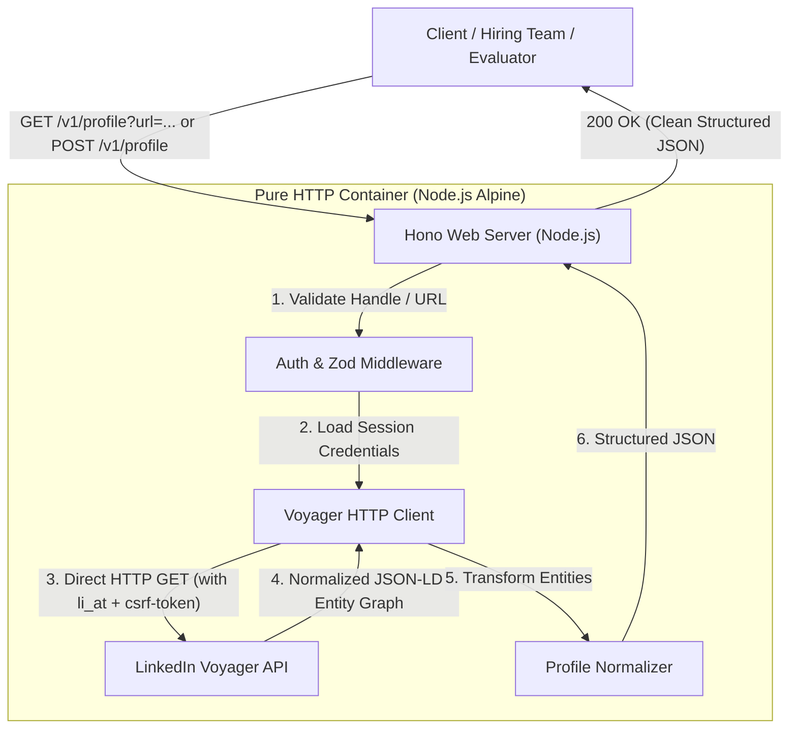

# LinkedIn Profile API (Pure HTTP Voyager Client)

A fast, lightweight, and structured LinkedIn Profile API built with **Hono**, **TypeScript**, and **Node.js**.

This service is a **pure reverse-engineered HTTP client** against LinkedIn's internal **Voyager REST API**. **There is no browser in it** — no Playwright, no Puppeteer, no Selenium, no Chromium, and no DOM rendering subprocesses.

---

## 📖 Live API Documentation & Web UI

When the server is running, visit **[http://localhost:3000/](http://localhost:3000/)** (or `/docs`) in your browser to access:

* 🎮 **Interactive Live UI**: Test profile extraction with one click.
* 📖 **OpenAPI Specification**: Accessible via `/openapi.json` and [`./openapi.yaml`](./openapi.yaml).
* 📑 **Offline Documentation**: Formatted markdown spec available in [`./API_SPEC.md`](./API_SPEC.md).

---

## 🏗 Architecture: How it Works



### Transport & Endpoints
| Component | Details |
|---|---|
| **Transport** | Native HTTP `fetch` (Pure HTTP, no browser) |
| **Primary Endpoint** | `GET https://www.linkedin.com/voyager/api/identity/dash/profiles?q=memberIdentity&...` |
| **Auth** | `li_at` cookie + `csrf-token` header (reverse-engineered from LinkedIn) |
| **Response Format** | `application/vnd.linkedin.normalized+json+2.1` |
| **Browser Dependencies** | **None** (No Playwright, no Chromium) |
| **Image Size** | Lightweight Docker container (`node:22-alpine`, ~120MB) |

---

## 📁 Repository Layout

```text
├── src/
│   ├── index.ts             # Server entrypoint & HTTP listener
│   ├── app.ts               # Hono app definition, middleware & routing
│   ├── docs/
│   │   ├── openapi.ts       # OpenAPI 3.1.0 JSON specification
│   │   └── ui.ts            # Clean Web UI
│   ├── routes/
│   │   └── profile.ts       # GET & POST /v1/profile endpoints
│   ├── linkedin/
│   │   ├── client.ts        # Session credential loader & username parser
│   │   ├── scraper.ts       # Direct Voyager API HTTP fetcher
│   │   └── parser.ts        # Voyager JSON entity normalizer
│   ├── fixtures/
│   │   └── ada-lovelace.json# Offline fixture for instant evaluation
│   └── schemas/
│       └── profile.ts       # Request/Response schemas & Zod validation
├── test/
│   └── test-api.ts          # Unit & integration test suite
├── Dockerfile               # Node 22 Alpine production container
├── openapi.yaml             # Standalone OpenAPI 3.1 YAML definition
├── API_SPEC.md              # Detailed Markdown API specification
├── render.yaml              # Render blueprint deployment definition
├── .dockerignore
├── .gitignore
├── .env.example
├── package.json
├── tsconfig.json
└── README.md
```

---

## 🚀 Quick Start (Local Setup)

### 1. Installation
```bash
git clone https://github.com/Viswesh934/Tross-api-spec.git
cd Tross-api-spec

npm install
```

### 2. Configure Environment
```bash
cp .env.example .env
```

Edit `.env`:
```env
PORT=3000
API_KEY=test-challenge-api-key-2026
LINKEDIN_LI_AT=AQEDAT...
```

### 3. Start Server
```bash
npm start
```
Open **[http://localhost:3000/](http://localhost:3000/)** in your browser!

---

## 🧪 Testing

Run the automated test suite verifying schema parsing, Voyager entity transformations, and API routes:
```bash
npm test
```

---

## 🌐 API Reference

### 1. Health Check
**Endpoint:** `GET /health`

```bash
curl -X GET http://localhost:3000/health
```

**Response (`200 OK`):**
```json
{
  "status": "healthy",
  "service": "linkedin-profile-api",
  "timestamp": "2026-08-29T18:50:00.000Z"
}
```

---

### 2. Fetch Profile

Supports both `GET` (query parameter) and `POST` (JSON body):

#### Using `GET`:
```bash
curl -X GET "http://localhost:3000/v1/profile?url=https://www.linkedin.com/in/williamhgates" \
  -H "x-api-key: test-challenge-api-key-2026"
```

#### Using `POST`:
```bash
curl -X POST http://localhost:3000/v1/profile \
  -H "Content-Type: application/json" \
  -H "x-api-key: test-challenge-api-key-2026" \
  -d '{"url": "https://www.linkedin.com/in/williamhgates"}'
```

#### Offline Fixture Mode:
You can test the endpoint without credentials using the bundled fixture:
```bash
curl "http://localhost:3000/v1/profile?url=ada-lovelace"
```

**Response (`200 OK`):**
```json
{
  "success": true,
  "profile": {
    "url": "https://www.linkedin.com/in/williamhgates",
    "name": "Bill Gates",
    "headline": "Chair, Gates Foundation and Founder, Breakthrough Energy",
    "location": "Seattle, Washington, United States",
    "about": "Co-chair of the Bill & Melinda Gates Foundation. Founder of Breakthrough Energy. Co-founder of Microsoft.",
    "image": "https://media.licdn.com/dms/image/v2/...",
    "experience": [
      {
        "title": "Co-chair",
        "company": "Bill & Melinda Gates Foundation",
        "employmentType": "Full-time",
        "duration": "2000 - Present",
        "startDate": "2000",
        "endDate": "Present",
        "location": "Seattle, WA",
        "description": "Guided by the belief that every life has equal value..."
      }
    ],
    "education": [
      {
        "school": "Harvard University",
        "degree": null,
        "fieldOfStudy": null,
        "duration": "1973 - 1975",
        "startDate": "1973",
        "endDate": "1975"
      }
    ],
    "skills": ["Software Development", "Philanthropy", "Global Health"],
    "certifications": [],
    "languages": [
      {
        "language": "English",
        "proficiency": "Native or bilingual"
      }
    ]
  }
}
```

---

## ☁️ Render Deployment Instructions

1. Push your code to your GitHub repository (`Viswesh934/Tross-api-spec`).
2. Log into the [Render Dashboard](https://dashboard.render.com/).
3. Click **New +** → **Web Service** → Connect your repository.
4. Choose **Docker** as the Runtime.
5. Under **Environment Variables**, add:
   * `PORT`: `3000`
   * `API_KEY`: `<your-api-key>`
   * `LINKEDIN_LI_AT`: `<your-li_at-cookie-value>`
   *(Or add `session.json` under **Secret Files** on Render)*.
6. Click **Create Web Service**.

---

## 📄 License
MIT
