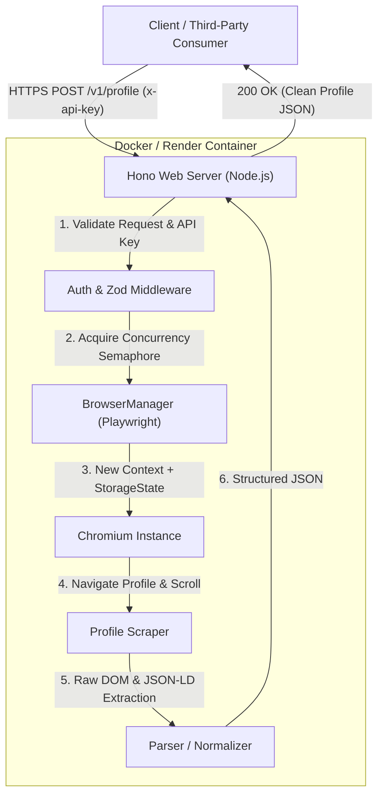

# LinkedIn Profile API

A fast, lightweight, and structured LinkedIn Profile Scraper API built with **Hono**, **Playwright (Chromium)**, and **TypeScript**, packaged for containerized deployment on **Docker** and **Render**.

---

## 🏗 Architecture



---

## ⚡ Features

- **Hono Web Framework**: High performance, minimal footprint, and first-class TypeScript support.
- **Playwright Automation**: Isolated browser contexts with authenticated session management (`storageState`).
- **Resilient Extraction**: Multi-layered section parsers with fallback to structured JSON-LD.
- **Strict Normalization**: Conforms to a clean schema (empty arrays `[]` for missing lists, `null` for missing scalars).
- **Concurrency & Resource Management**: Built-in semaphore control and automatic context cleanup.
- **Production Ready**: Full Docker configuration, `/health` endpoint, API key authentication, and Render deployment support.

---

## 📁 Repository Layout

```text
├── src/
│   ├── index.ts             # Server entrypoint & lifecycle shutdown
│   ├── app.ts               # Hono app definition, middleware & routing
│   ├── routes/
│   │   └── profile.ts       # POST /v1/profile endpoint
│   ├── linkedin/
│   │   ├── browser.ts       # Chromium lifecycle & concurrency manager
│   │   ├── scraper.ts       # Page navigation, scrolling & extraction
│   │   └── parser.ts        # Section normalization & text cleaning
│   └── schemas/
│       └── profile.ts       # Request/Response schemas & Zod validation
├── scripts/
│   └── auth.ts              # Interactive CLI session capture script
├── test/
│   └── test-api.ts          # Unit & integration test suite
├── Dockerfile               # Production container definition
├── .dockerignore
├── .gitignore
├── .env.example             # Example environment configuration
├── package.json
├── tsconfig.json
└── README.md
```

---

## 🚀 Quick Start (Local Setup)

### 1. Prerequisites
- **Node.js**: v20+ or v22+
- **npm**: v10+

### 2. Installation
Clone the repository and install dependencies:
```bash
git clone https://github.com/Viswesh934/Tross-api-spec.git
cd Tross-api-spec

npm install
npx playwright install chromium --with-deps
```

### 3. Configure Environment
Copy the example environment file:
```bash
cp .env.example .env
```

Edit `.env`:
```env
PORT=3000
API_KEY=my_super_secret_key_123
LINKEDIN_STORAGE_STATE=session.json
MAX_CONCURRENT_SCRAPES=2
SCRAPE_TIMEOUT_MS=35000
```

---

## 🔑 Authentication & Session Setup

LinkedIn requires an active session to view detailed profile sections. To capture an authenticated Playwright session state:

1. Run the interactive authentication helper:
   ```bash
   npm run auth
   ```
2. A Chromium browser window will open at `https://www.linkedin.com/login`.
3. Log into your LinkedIn account and complete any two-factor (2FA) verification.
4. Once you reach your LinkedIn feed, switch back to the terminal and press <kbd>Enter</kbd>.
5. The session state is saved to `session.json` (which is git-ignored).

> [!WARNING]
> Never commit `session.json` or paste sensitive session credentials into version control.

---

## 🧪 Testing

Run the automated test suite verifying schemas, data normalization, error handling, and API routes:
```bash
npm test
```

---

## 🌐 API Specification

### 1. Health Check
Checks service availability and configuration state.

**Endpoint:** `GET /health`

```bash
curl -X GET http://localhost:3000/health
```

**Response (200 OK):**
```json
{
  "status": "healthy",
  "service": "linkedin-profile-api",
  "timestamp": "2026-08-29T16:45:00.000Z",
  "config": {
    "storageStateConfigured": true,
    "apiKeyConfigured": true,
    "maxConcurrency": 2
  }
}
```

---

### 2. Scrape Profile
Extracts structured information for a given LinkedIn profile URL.

**Endpoint:** `POST /v1/profile`

**Headers:**
- `Content-Type: application/json`
- `x-api-key: <YOUR_API_KEY>` (or `Authorization: Bearer <YOUR_API_KEY>`)

**Request Body:**
```json
{
  "url": "https://www.linkedin.com/in/satyanadella/"
}
```

**Example Request:**
```bash
curl -X POST http://localhost:3000/v1/profile \
  -H "Content-Type: application/json" \
  -H "x-api-key: my_super_secret_key_123" \
  -d '{"url": "https://www.linkedin.com/in/satyanadella/"}'
```

**Response Schema (200 OK):**
```json
{
  "success": true,
  "profile": {
    "url": "https://www.linkedin.com/in/satyanadella/",
    "name": "Satya Nadella",
    "headline": "Chairman and CEO at Microsoft",
    "location": "Redmond, Washington, United States",
    "about": "Believing in the power of technology to empower every person and organization.",
    "image": "https://media.licdn.com/dms/image/...",
    "experience": [
      {
        "title": "Chairman and CEO",
        "company": "Microsoft",
        "employmentType": "Full-time",
        "duration": "Feb 2014 - Present · 10 yrs",
        "startDate": "Feb 2014",
        "endDate": "Present",
        "location": "Redmond, Washington",
        "description": "Leading Microsoft's mission to empower every person and every organization on the planet to achieve more."
      }
    ],
    "education": [
      {
        "school": "University of Chicago Booth School of Business",
        "degree": "Master of Business Administration - MBA",
        "fieldOfStudy": null,
        "duration": "1994 - 1997",
        "startDate": "1994",
        "endDate": "1997",
        "description": null
      }
    ],
    "skills": [
      "Cloud Computing",
      "Enterprise Software",
      "Strategic Leadership"
    ],
    "certifications": [],
    "languages": [
      {
        "language": "English",
        "proficiency": "Native or bilingual proficiency"
      }
    ]
  }
}
```

---

## 🐳 Docker Deployment

Build and run the container locally:

```bash
# Build the Docker image
docker build -t linkedin-profile-api .

# Run container with environment variables
docker run -d \
  -p 3000:3000 \
  -e API_KEY="my_super_secret_key_123" \
  -v $(pwd)/session.json:/app/session.json \
  -e LINKEDIN_STORAGE_STATE="/app/session.json" \
  --name linkedin-api \
  linkedin-profile-api
```

---

## ☁️ Render Deployment Instructions

1. Push your code to your GitHub repository (`Viswesh934/Tross-api-spec`).
2. Log into the [Render Dashboard](https://dashboard.render.com/).
3. Click **New +** → **Web Service**.
4. Connect your GitHub repository.
5. Choose **Docker** as the Runtime.
6. Under **Environment Variables**, add:
   - `PORT`: `3000` (or Render default)
   - `API_KEY`: `<your-secure-api-key>`
   - `LINKEDIN_STORAGE_STATE`: Paste the entire content of `session.json` directly as a JSON string, or upload as a Secret File and set the path.
   - `MAX_CONCURRENT_SCRAPES`: `2`
   - `SCRAPE_TIMEOUT_MS`: `35000`
7. Click **Create Web Service**.
8. Render will build the container and provide your public URL: `https://<service-name>.onrender.com`.

---

## 🔒 Security & Privacy Notes

- **API Protection**: All extraction requests require a valid API key header.
- **Session Isolation**: Each scrape runs in a separate, isolated browser context.
- **No Data Retention**: Extracted profile information is returned in-memory and never written to disk or logs.
- **Safe Secrets Handling**: `session.json`, `*storage-state*.json`, and `.env` files are strictly excluded via `.gitignore` and `.dockerignore`.
- **Concurrency & Rate Limits**: Built-in semaphore prevents resource exhaustion on the host container.

---

## ⚠️ Known Limitations

- **Session Expiration**: LinkedIn browser sessions expire periodically and may require re-running `npm run auth`.
- **Private Profiles**: Profiles set to restricted privacy modes by their owners will reflect only the information visible to the authenticated session.
- **Rate Limiting**: Automated scraping should be conducted respectfully within LinkedIn's rate limits to avoid temporary checkpoints.

---

## 📄 License
MIT
